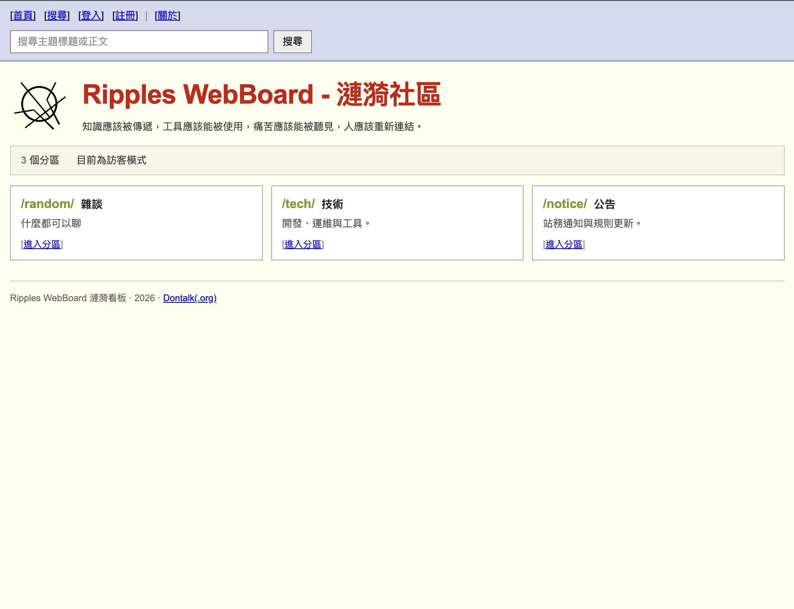
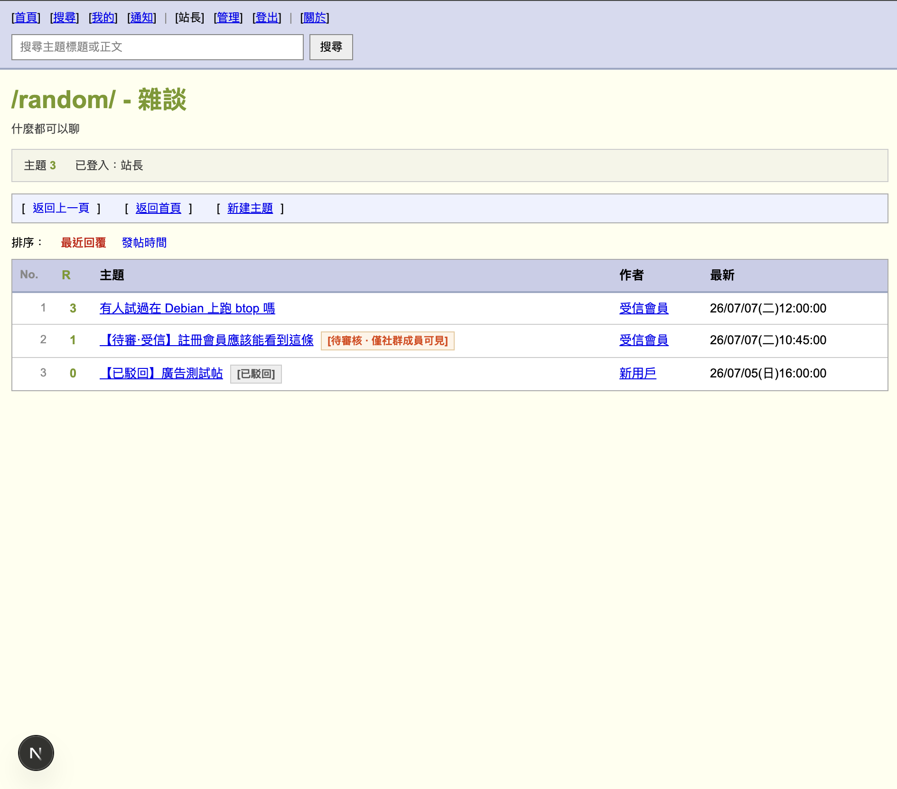
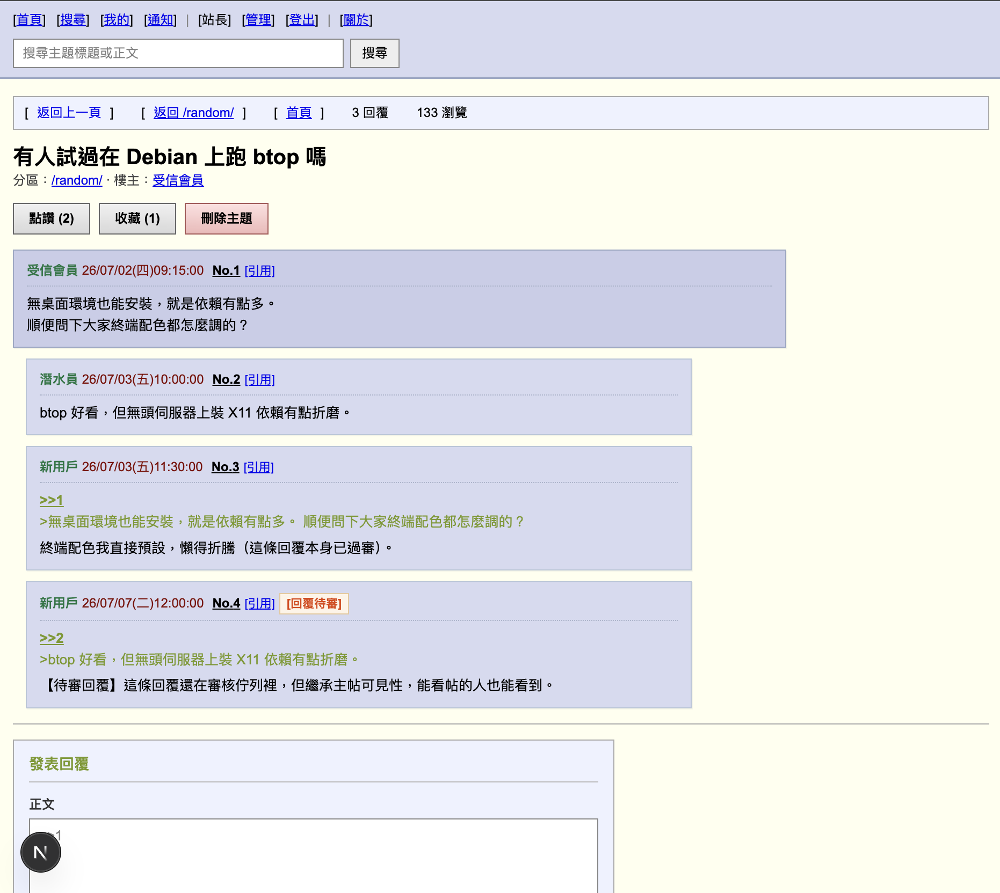
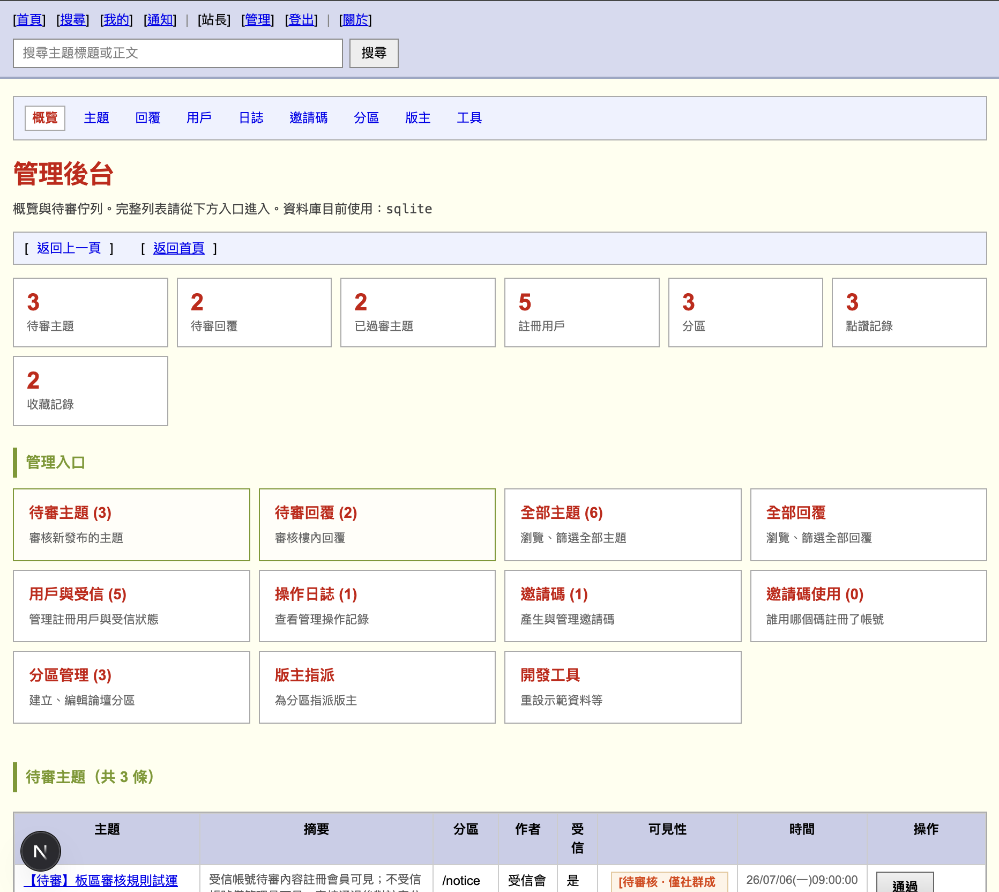
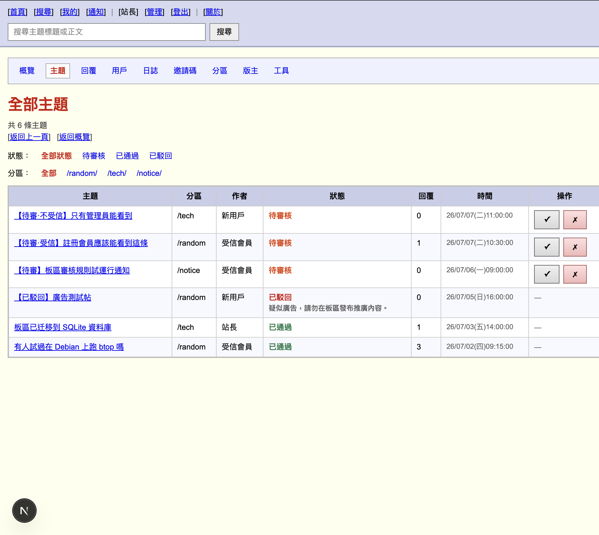
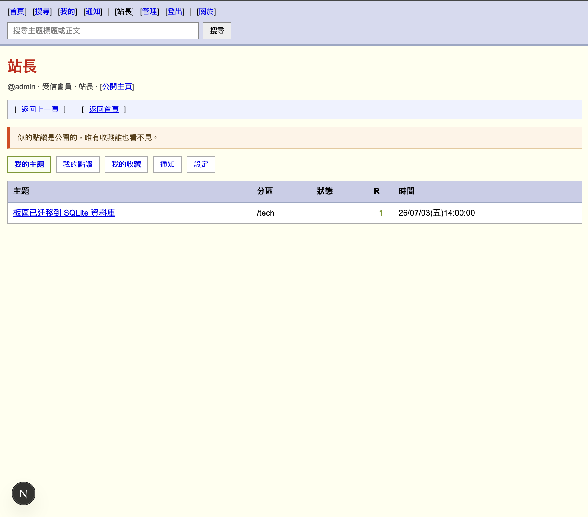
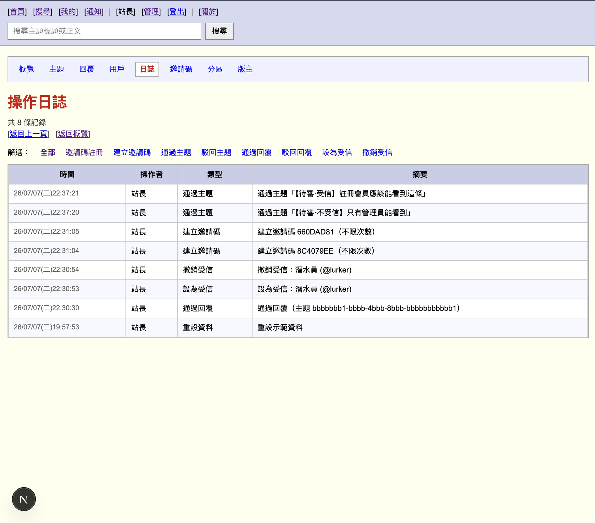

# Ripples WebBoard

**漣漪看板** — 分區優先的多元討論板(WebBoard BBS)。UI 參考經典 Imageboard / 文字看板（如 2chan、4chan、PTT 等）

開源項目，由 [Dontalk(.org)](https://dontalk.org) 實驗沙盒獨立出來。  
GitHub：<https://github.com/infoabcd/Ripples-WebBoard.git>

> 代碼使用 **MIT** 許可證，部分程式碼由 AI 輔助生成。部署或二次開發時，請保留 **項目地址** 與 **Dontalk(.org)** 署名。

## 快速開始

```bash
git clone https://github.com/infoabcd/Ripples-WebBoard.git
cd ripples-webboard
cp .env.example .env
npm install
npm run dev
```

瀏覽 <http://localhost:3100>。首次啟動會執行資料庫遷移；`.env` 必填項未設定時應用會直接報錯。

生產環境：

```bash
npm run build
npm run start
```

配置項見 `.env.example`（資料庫方言、邀請註冊、SMTP 等）。
`.env.example` 註解已經把配置需要的寫得很清楚明白

**關於資料庫**：

資料庫默認SQLite，目錄在 ./data/boards.sqlite(下面默認)。

你會發現沒有data這個資料夾和SQLite文件，沒關係，啟動後會自動生成。

### **手動建立站長(超級用戶)帳號**：（此前請先啟動一次程式，初始化資料庫）

```bash
用法：
  npm run db:create-super_users -- --username <用戶名> --password <密碼> [選項]
  npm run db:create-super_users -- --password <密碼> --hash-only

選項：
  --username       用戶名（3-20 位小寫字母/數字/底線）
  --password       明文密碼（至少 6 位）；亦可設環境變數 ADMIN_PASSWORD
  --display-name   顯示名稱（預設同用戶名）
  --email          電郵（可選）
  --hash-only      僅輸出 bcrypt 雜湊，不寫入資料庫
  -h, --help       顯示說明

示例：
  npm run db:create-super_users -- --username admin --password 'your-secure-password' --display-name 站長
  ADMIN_PASSWORD='secret' npm run db:create-super_users -- --username admin
```

## 功能

- **分區優先**：首頁選分區 → 目錄 → 主題 → 回覆
- **註冊 / 登入**：新帳號預設不受信；可設定為邀請碼註冊或開放註冊
- **邀請碼**：站長可產生邀請碼、設定次數與備註；記錄誰以哪個碼註冊
- **受信分級審核**：
  - 不受信用戶的待審主題/回覆：僅作者、版主、站長可見
  - 受信用戶的待審內容：註冊會員即可見（仍待審核，社群可參與討論）
  - 已通過內容對訪客與會員公開；被駁回內容僅作者與管理可見
- **發帖 / 回覆配圖**：每帖最多一張；想加更多圖片可跟帖回覆
- **點讚 / 收藏**：點讚公開；收藏僅本人可見
- **個人中心** `/me`：自己的主題、點讚、收藏、通知、電郵設定
- **會員主頁** `/u/[username]`：須登入後查看他人公開主題與點讚；收藏不對外展示
- **搜尋** `/search`：在可見主題與回覆正文中搜尋
- **`>>N` 引用**：樓中樓引用，可點擊跳轉
- **管理後台** `/dashboard`：站長全站管理；版主僅所轄分區的待審內容與操作
- **審核通知**：站內通知；可選 SMTP 電郵提醒
- **操作日誌**：站長可查看管理操作記錄
- **關於頁** `/about`：站內使用說明與社群約定

# 示範資料(由AI生成)

`scripts/snapshots/` 內含示範用 SQL（`dev-data.sql`；完整 schema 見 `schema.sql`）。先讓應用對空庫執行遷移，再匯入資料：

```bash
sqlite3 data/boards.sqlite < scripts/snapshots/dev-data.sql
```

MariaDB 等其它方言：遷移建表後執行同一檔案即可（細節見 `scripts/snapshots/README.md`）。匯入後可使用下列帳號登入；邀請碼示範為 `DEMO-INVITE`。

## 示範帳號

| 用戶 | 密碼 | 說明 |
|------|------|------|
| `admin` | `admin123` | 站長，可進 `/dashboard` 全站管理 |
| `modtech` | `modtech123` | `/tech/` 分區版主 |
| `trusted` | `trusted123` | 受信會員；待審帖註冊會員可見 |
| `newbie` | `newbie123` | 不受信新號；待審帖僅作者、版主、站長可見 |
| `lurker` | `lurker123` | 不受信潛水員 |

---

# 截圖(截圖內數據由AI生成)















---

# License

[MIT](./LICENSE)
